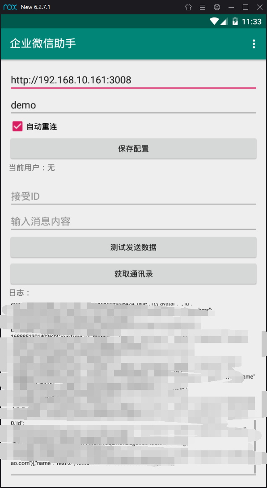

## 企业微信 Xposed 之谜

仅供学习总结使用，无任何别意，请勿非法用途，仅供学习参考，学习交流可以加微信：zhaojunlike，拉你进群。当前版本不再提供任何更新，支持企业微信版本：2.7.2，当前最新版本2.7.5，后续将会继续研究协议。

## 目前功能

-  [x] 支持websocket推送
-  [x] 支持消息接受，文本消息发送，群at人
-  [x] 支持通讯录获取
-  [x] 群成员列表获取
-  [ ] 当前用户登录事件
-  [ ] hook通知事件
-  [ ] 添加好友
-  [ ] 自动检测微信手机号是否注册
-  [ ] 企业微信家里蹲打卡

## 核心扩展
-  [ ] 自动登录
-  [ ] 消息群发
-  [ ] 支付收款

## 📑 License

[MIT License](./LICENSE)
